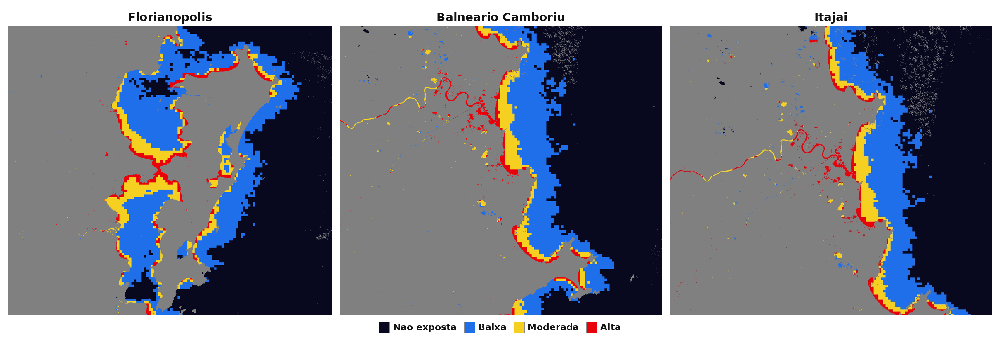

# Etapa 7 — Comparação entre cidades

Análise dos resultados: comparação visual das três cidades costeiras a partir dos mapas
de exposição da água à luz noturna (Etapa 6). Terra em cinza; água classificada em
**não exposta**, **baixa**, **moderada** e **alta** exposição.

Mapas individuais: `saida_etapa6/mapa_exposicao_florianopolis.png`,
`saida_etapa6/mapa_exposicao_balneario_camboriu.png`,
`saida_etapa6/mapa_exposicao_itajai.png`.

---

## Quadro comparativo (qualitativo)

| Cidade | Presença de água | Intensidade da luz | Proximidade luz↔água | Extensão exposta | Caráter dominante | Observação principal |
| --- | --- | --- | --- | --- | --- | --- |
| Florianópolis | Alta | Alta | Alta | Alta | Urbano + turístico | Orla das baías Norte e Sul e o estreito central iluminados em quase toda a volta; maior extensão de água exposta. |
| Balneário Camboriú | Alta | Alta (concentrada) | Alta | Média | Turístico / vertical | Pico intenso ao longo da orla verticalizada e na foz do rio Camboriú; exposição em faixa estreita e concentrada. |
| Itajaí | Alta | Alta (pontual) | Alta | Média | Portuário | Hotspot na foz/canal do Itajaí-Açu e na área portuária; exposição concentrada no porto. |

Os níveis (Alta/Média/Baixa) vêm da **leitura visual dos mapas**, não de medições.

---

## Leitura comparativa

**Intensidade da luz.** As três cidades apresentam pontos de alta intensidade (vermelho)
colados à água, mas com padrões diferentes. Em **Florianópolis** a luz forte aparece
distribuída por toda a orla interna das baías e no estreito central (centro e pontes).
Em **Balneário Camboriú** ela se concentra numa faixa estreita e muito intensa ao longo
da orla verticalizada. Em **Itajaí** o realce é mais pontual, na foz/canal do rio e na
zona portuária.

**Proximidade luz↔água.** Em todas as cidades a luz urbana aparece imediatamente
adjacente à água — orlas, baías, rios e canais —, o que é o indício central buscado pelo
trabalho: ambientes aquáticos diretamente expostos à emissão luminosa urbana.

**Extensão das áreas expostas.** Aqui está a maior diferença. Florianópolis tem a maior
extensão de água exposta, por combinar ilha, duas baías e uma orla muito recortada.
Balneário Camboriú e Itajaí concentram a exposição em faixas/pontos (orla e foz; porto e
canal), com menor extensão aparente.

**Diferença entre os perfis urbanos.** Cada cidade ilustra um tipo de fonte:
Florianópolis como centro **urbano e turístico** com águas internas (baías); Balneário
Camboriú como orla **turística verticalizada**, onde a barreira de prédios concentra luz
sobre a praia e a foz; Itajaí como polo **portuário**, com a luz concentrada na
infraestrutura do porto e no canal de acesso.

---

## Síntese

**Florianópolis** aparenta a maior exposição global, pela extensão de orla e águas
internas iluminadas. **Balneário Camboriú** e **Itajaí** mostram exposição mais
concentrada — na orla turística e na zona portuária, respectivamente —, mas igualmente
relevante por estar diretamente sobre a água. O padrão comum às três é claro: a luz
artificial mais intensa ocorre exatamente na interface entre cidade e água, sustentando
a hipótese de exposição de ambientes aquáticos costeiros à poluição luminosa.

Esta comparação prepara a **Etapa 8 (discussão)** — relacionar o padrão observado aos
riscos ecológicos do artigo — e a **Etapa 9 (conclusão)**.
