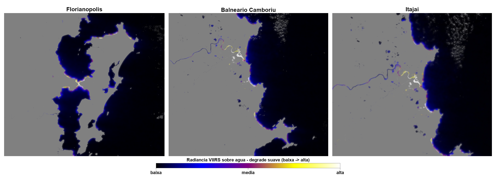
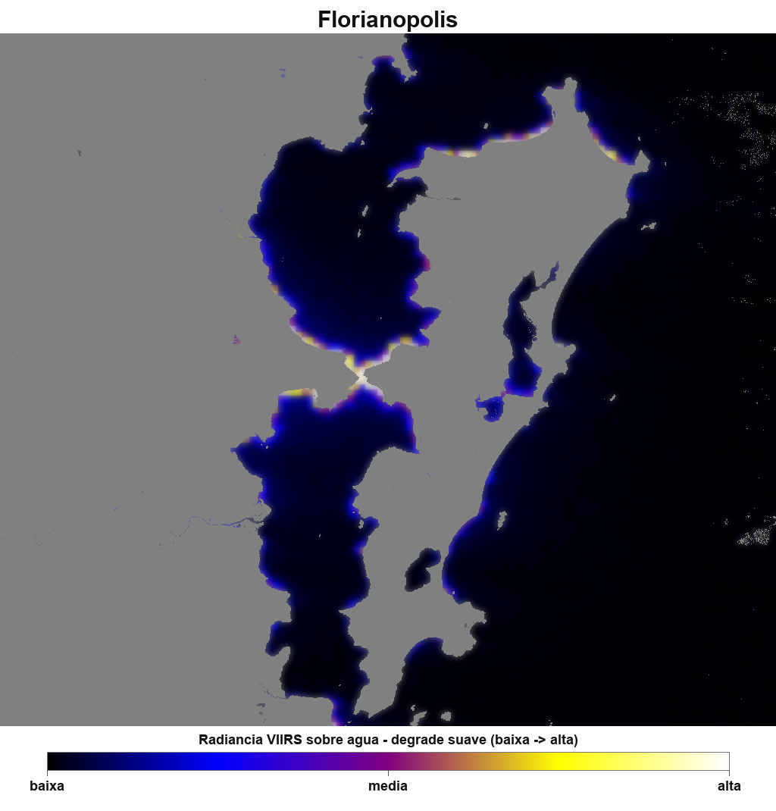
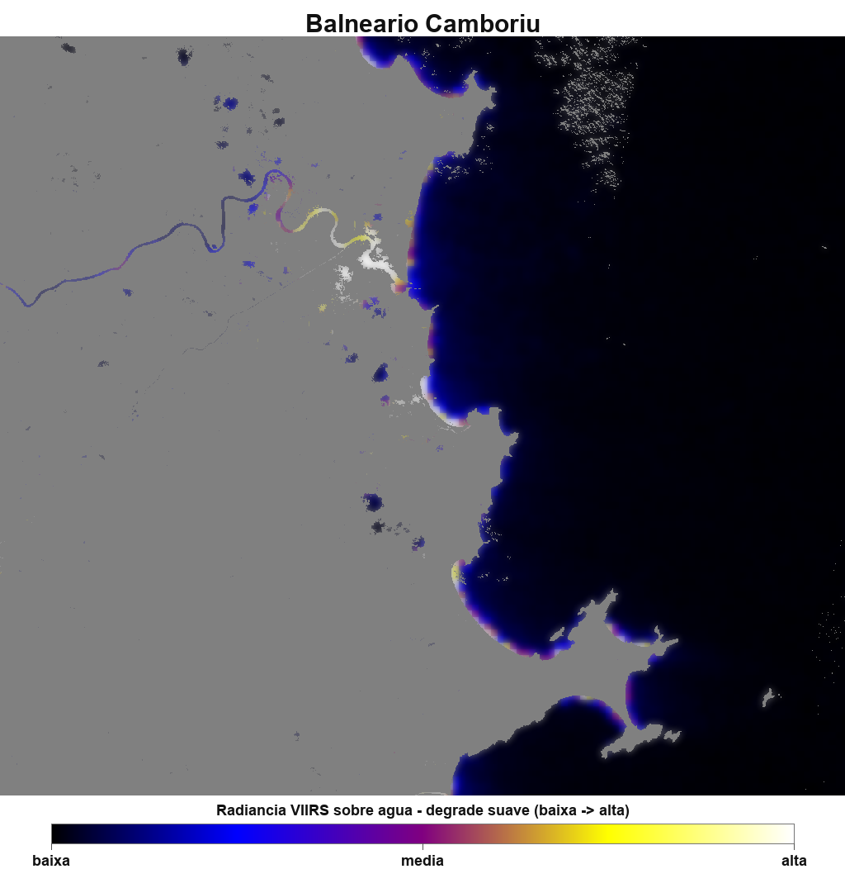
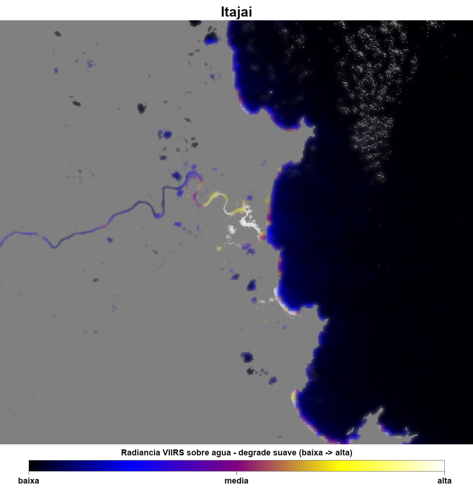

# Light Pollution on the Coast of Santa Catarina

Final project for the Image Processing course.

Authors: Pedro Pacheco and Carlos Soler.

## Assignment

Given a dataset of satellite night-light images, the team should choose and implement a classifier using TensorFlow, Keras, or scikit-learn to investigate spatial change and growth patterns. The project has an exploratory/research character and should connect image-processing techniques with topics discussed in the course.

## Project Goal

This project investigates whether artificial light at night appears close to aquatic environments in three coastal cities of Santa Catarina, Brazil:

- Florianopolis
- Balneario Camboriu
- Itajai

The work adapts the assignment into an exploratory remote-sensing workflow focused on coastal light pollution. Instead of training a supervised neural network, the project uses an image-processing classifier/pipeline based on water segmentation, VIIRS night-light radiance, continuous gradients, qualitative exposure classes, and visual comparison between cities.

## Why It Matters

Artificial light at night can negatively affect coastal and aquatic ecosystems. In expanding metropolitan and coastal areas, urban lighting, ports, roads, tourism infrastructure, and vertical development can increase nighttime light exposure over beaches, bays, rivers, channels, and estuaries.

Possible ecological impacts include changes in orientation, feeding, reproduction, migration, predator-prey interactions, and biological cycles of aquatic and coastal organisms.

## What Was Built

The repository contains a complete image-processing workflow:

1. Satellite imagery and reference images were collected for the selected cities.
2. Water and land were separated using Sentinel-2 and MNDWI.
3. VIIRS night-light radiance was applied over the water mask.
4. Exposure maps were generated with a continuous gradient.
5. A smoother gradient version was created to reduce visible satellite-cell boundaries.
6. The three cities were compared visually and qualitatively.
7. A final report was produced with methodology, model architecture, classification, tests, code explanations, inputs, outputs, and result discussion.

## Main Result

The maps indicate that all three cities have artificial night light close to aquatic environments.

- Florianopolis shows the largest apparent exposed water extent, mainly around bays and the central strait.
- Balneario Camboriu shows concentrated exposure along the verticalized tourist waterfront and the Camboriu River mouth.
- Itajai shows concentrated exposure around the port area and the Itajai-Acu channel/river mouth.



## Individual Smooth Gradient Outputs

### Florianopolis



### Balneario Camboriu



### Itajai



## Repository Structure

```text
.
|-- Article.pdf
|-- README.md
|-- Relatorio_Completo_Degrade_Suave.docx
|-- collect_sentinel_water_images.py
|-- download_viirs_night_lights.py
|-- water_land_separation.py
|-- water_light_exposure.py
|-- city_comparison.py
|-- generate_smooth_gradient.py
`-- Images/
    |-- input/
    |-- mndwi/
    |-- water-masks/
    |-- viirs-water/
    |-- exposure-gradient/
    |-- smooth-gradient/
    |-- comparisons/
    `-- reference/
```

## Image Outputs

- `Images/input/`: original day and night reference images.
- `Images/mndwi/`: MNDWI visualizations used to support water identification.
- `Images/water-masks/`: binary water masks.
- `Images/viirs-water/`: VIIRS night-light radiance over water.
- `Images/exposure-gradient/`: continuous gradient exposure maps.
- `Images/smooth-gradient/`: smoothed gradient maps for each city.
- `Images/comparisons/`: side-by-side city comparisons.
- `Images/reference/`: reference images used during development.

## How To Reproduce The Main Outputs

The Google Earth Engine scripts require an authenticated Earth Engine environment and the project id configured in the scripts.

Generate water/land and VIIRS layers:

```bash
python water_land_separation.py
python water_light_exposure.py
```

Generate the city comparison:

```bash
python city_comparison.py
```

Generate the smoother gradient images:

```bash
python generate_smooth_gradient.py
```

## Final Report

The final report used as project base is:

```text
Relatorio_Completo_Degrade_Suave.docx
```

It includes the problem description, dataset setup, preprocessing, model/pipeline architecture, calibration/training discussion, classification, tests, source-code explanations, input/output demonstrations, and discussion of the results.
